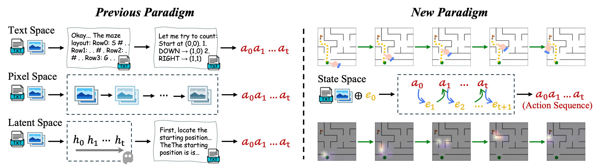
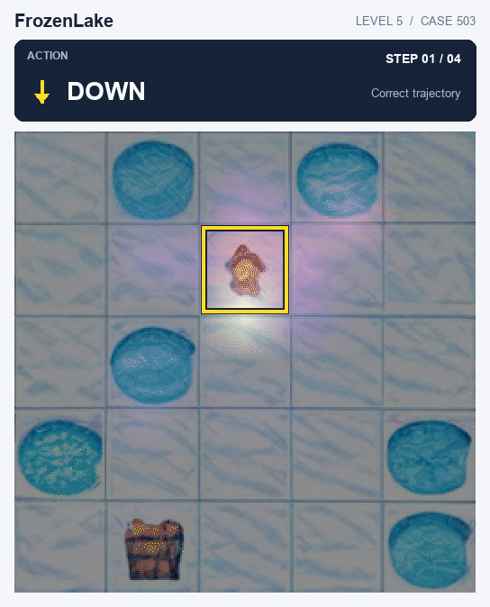
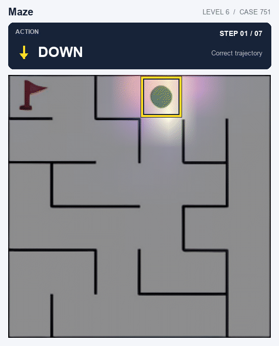
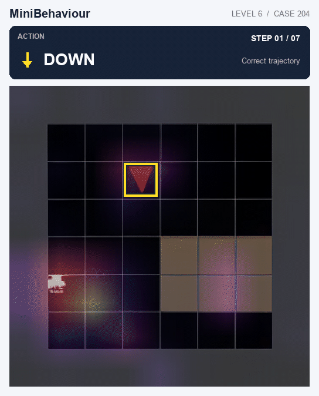

# State-Space Visual Reasoning (SSVR)

## Abstract

Despite rapid progress in vision-language-action (VLA) models, existing reasoning paradigms still face a fundamental *state-representation mismatch* in open-loop planning. Given only an initial observation, models must internally simulate action-conditioned state transitions, whereas text-, pixel-, and latent-space reasoning can suffer from lossy spatial compression, error-accumulating visual generation, and bypass of intermediate latent tokens, respectively, undermining reliable long-horizon planning. We propose **State-Space Visual Reasoning** (SSVR), which decouples static visual context, language constraints, and a recurrent latent state. SSVR encodes the initial image and instruction once, then conditions each action prediction on the latent state and updates it with an action-conditioned GRU. Using Qwen2.5-VL as the backbone, SSVR achieves 99.5/99.6, 96.3/98.0, and 83.9/90.6 EM/PR on FrozenLake, Maze, and MiniBehavior, substantially outperforming prior methods. Extensive experiments support the effectiveness of recurrent state modeling for VLA open-loop planning across input transformations and transfer settings. By reusing static visual-textual context and updating a compact recurrent state, SSVR supports efficient multi-step inference, achieving up to **98.58×** faster Maze decoding rollouts than the evaluated baselines with the prefix cache prebuilt.

## Overview



## Attention visualizations

Gradient-weighted attention across planning steps on FrozenLake, Maze, and MiniBehaviour.

| FrozenLake | Maze | MiniBehaviour |
| --- | --- | --- |
|  |  |  |

## Installation

Run commands from `ssvr/` on Linux with NVIDIA GPUs supporting BF16. Use Python 3.12 and the pinned dependencies, including [PyTorch 2.5.1 with CUDA 12.4](https://pytorch.org/get-started/previous-versions/#v251).

```bash
cd /path/to/ssvr
conda create -n ssvr python=3.12 -y
conda activate ssvr
python -m pip install --upgrade pip
python -m pip install -r requirements.txt --extra-index-url https://download.pytorch.org/whl/cu124

export PROJECT_ROOT="$(pwd)"
export PYTHON="$(command -v python)"
export QWEN_MODEL_PATH="$PROJECT_ROOT/models/Qwen2.5-VL-7B-Instruct"
export QWEN_PROCESSOR_PATH="$QWEN_MODEL_PATH"
export DATA_ROOT="$PROJECT_ROOT/dataset"
export QWEN_VISUAL_IMAGE_ROOT="$PROJECT_ROOT/output/qwen_visual_initial_maps_vqvae"
export NUM_GPUS=8
export SKIP_IMAGE_PREP=0
export SWANLAB_MODE=disabled
export EXP_ID="$(date -u +%Y%m%dT%H%M%SZ)_$$"

huggingface-cli download Qwen/Qwen2.5-VL-7B-Instruct --local-dir "$QWEN_MODEL_PATH"
```

Use an existing local backbone by changing `QWEN_MODEL_PATH` and `QWEN_PROCESSOR_PATH`. The pinned Hugging Face Hub version provides [`huggingface-cli`](https://github.com/huggingface/huggingface_hub/blob/v0.29.1/docs/source/en/guides/cli.md); use `huggingface-cli login` if authentication is needed.

## Dataset preparation

Download SFT-Random training data from [FrozenLake](https://huggingface.co/datasets/yixu1/SFT_random_frozen), [Maze](https://huggingface.co/datasets/yixu1/SFT_random_maze), and [MiniBehaviour](https://huggingface.co/datasets/yixu1/SFT_random_mini):

```bash
huggingface-cli download yixu1/SFT_random_frozen train_dataset.jsonl \
  --repo-type dataset --local-dir "$DATA_ROOT/frozenlake/tokenized_dataset/SFT_random"
huggingface-cli download yixu1/SFT_random_maze train_dataset.jsonl \
  --repo-type dataset --local-dir "$DATA_ROOT/maze/tokenized_dataset/SFT_random"
huggingface-cli download yixu1/SFT_random_mini train_dataset.jsonl \
  --repo-type dataset --local-dir "$DATA_ROOT/minibehaviour/tokenized_dataset/SFT_random"
```

These repositories provide training data only. Keep the original evaluation files already present under `dataset/<task>/tokenized_dataset/SFT/test_dataset.jsonl`; if using an external `DATA_ROOT`, copy those files into the same relative locations. The required layout is:

```text
$DATA_ROOT/
├── frozenlake/tokenized_dataset/{SFT_random/train_dataset.jsonl,SFT/test_dataset.jsonl}
├── maze/tokenized_dataset/{SFT_random/train_dataset.jsonl,SFT/test_dataset.jsonl}
└── minibehaviour/tokenized_dataset/{SFT_random/train_dataset.jsonl,SFT/test_dataset.jsonl}
```

`TRAIN_DATASET`, `EVAL_DATASET`, and `TEST_DATASET` select training, training-time evaluation, and final evaluation inputs. Examples use the original test split for both evaluation roles, following the existing launchers. Preserve task names in training paths because the trainer uses them to identify tasks. JSONL files must contain the actual records, not Git LFS pointers.

Image caches are generated automatically with `SKIP_IMAGE_PREP=0`, using [the VQ-VAE weights](https://huggingface.co/Emma02/vqvae_ckpts). For offline use, set `VQVAE_DIR=/path/to/vqvae` containing `config.json` and `pytorch_model.bin`. Once caches cover all inputs, set `SKIP_IMAGE_PREP=1` to reuse them. To prepare a cache separately:

```bash
TASKS=maze \
TRAIN_DATASET="$DATA_ROOT/maze/tokenized_dataset/SFT_random/train_dataset.jsonl" \
EVAL_DATASET="$DATA_ROOT/maze/tokenized_dataset/SFT/test_dataset.jsonl" \
TEST_DATASET="$DATA_ROOT/maze/tokenized_dataset/SFT/test_dataset.jsonl" \
  bash scripts/common/prepare_images.sh
```

For VQAv2 and full ablations, download the validation questions, validation annotations, and COCO validation images from the [official VQA v2 page](https://huggingface.co/datasets/HuggingFaceM4/VQAv2), then extract them into:

```text
/path/to/vqav2/
├── v2_OpenEnded_mscoco_val2014_questions.json
├── v2_mscoco_val2014_annotations.json
└── val2014/COCO_val2014_*.jpg
```

VQAv2 judging requires `DASHSCOPE_API_KEY` in the environment. Defaults are 1,000 randomly selected questions with seed 2026 and the `qwen3.6-flash` judge. The reported VQAv2 accuracy is semantic accuracy from this judge.

## Main experiments and model training

Each task has its own script. This loop runs FrozenLake, Maze, and MiniBehaviour independently, preparing images, training, evaluating the final checkpoint, and saving results:

```bash
for task in frozenlake maze minibehaviour; do
  TRAIN_DATASET="$DATA_ROOT/$task/tokenized_dataset/SFT_random/train_dataset.jsonl" \
  EVAL_DATASET="$DATA_ROOT/$task/tokenized_dataset/SFT/test_dataset.jsonl" \
  TEST_DATASET="$DATA_ROOT/$task/tokenized_dataset/SFT/test_dataset.jsonl" \
  RUN_DIR="$PROJECT_ROOT/output/reproductions/${task}_${EXP_ID}" \
    bash "scripts/main/${task}.sh" all
done
```

To train only or evaluate an existing checkpoint, use `train` or `eval`. These examples use Maze; replace the task and dataset paths for the other tasks:

```bash
TRAIN_DATASET="$DATA_ROOT/maze/tokenized_dataset/SFT_random/train_dataset.jsonl" \
EVAL_DATASET="$DATA_ROOT/maze/tokenized_dataset/SFT/test_dataset.jsonl" \
TEST_DATASET="$DATA_ROOT/maze/tokenized_dataset/SFT/test_dataset.jsonl" \
  bash scripts/main/maze.sh train

TEST_DATASET="$DATA_ROOT/maze/tokenized_dataset/SFT/test_dataset.jsonl" \
CHECKPOINT=/path/to/maze/checkpoint-N \
  bash scripts/main/maze.sh eval
```

Planning inference supports `USE_KV_CACHE=1` to reuse the static image/text prefix, or `USE_KV_CACHE=0` to disable caching (default). This also controls planning evaluation during training; training forwards and attention attribution remain unchanged. Python evaluation entry points accept `--use_kv_cache` / `--no-use_kv_cache`.

```bash
USE_KV_CACHE=1 \
TEST_DATASET="$DATA_ROOT/maze/tokenized_dataset/SFT/test_dataset.jsonl" \
CHECKPOINT=/path/to/maze/checkpoint-N \
  bash scripts/main/maze.sh eval
```

Defaults are 8 GPUs, batch size 16 per GPU, learning rate `1.5e-4`, a 10-epoch cosine schedule stopping after epoch 5, model initialization seed 2026, and up to 1,000 planning evaluation samples. Override them with `NUM_GPUS`, `PER_DEVICE_BATCH_SIZE`, `LEARNING_RATE`, `NUM_EPOCHS`, `STOP_AFTER_EPOCHS`, `SEED`, and `EVAL_MAX_SAMPLES`. Gradient accumulation is fixed at 1; changing GPU count or batch size changes the training setup.

## MazeFlip

MazeFlip adds dynamic observation frames: LEFT/RIGHT world moves flip subsequent views vertically; UP/DOWN moves flip them horizontally. The model receives only the initial map and infers view-frame actions through latent evolution.

```bash
MAZE_TRAIN_SOURCE="$DATA_ROOT/maze/tokenized_dataset/SFT_random/train_dataset.jsonl" \
MAZE_VALIDATION_SOURCE="$DATA_ROOT/maze/tokenized_dataset/SFT/test_dataset.jsonl" \
MAZE_FLIP_DATA_ROOT="$DATA_ROOT/maze_flip/tokenized_dataset" \
TRAIN_DATASET="$DATA_ROOT/maze_flip/tokenized_dataset/SFT_random/train_dataset.jsonl" \
EVAL_DATASET="$DATA_ROOT/maze_flip/tokenized_dataset/SFT/test_dataset.jsonl" \
TEST_DATASET="$DATA_ROOT/maze_flip/tokenized_dataset/SFT/test_dataset.jsonl" \
  bash scripts/additional/reproduce_maze_flip.sh
```

This constructs or reuses the derived dataset, prepares images, trains, and evaluates. Set `OVERWRITE=1` to rebuild data. For individual stages, `scripts/additional/maze_flip.sh` accepts `prepare`, `all`, `train`, and `eval`; use the same source/output paths for `prepare`, and generated dataset paths for training/evaluation.

## Ablations

| Script in `scripts/ablations/` | Setting | Evaluations |
| --- | --- | --- |
| `ssvr.sh` | α=0.7, text-token actions | Maze, paraphrase, image scales 0.7/1.3, VQAv2 |
| `alpha_1p0.sh` | α=1.0, text-token actions | Same |
| `alpha_0p4.sh` | α=0.4, text-token actions | Same |
| `ssvr_head.sh` | α=0.7, linear action head | Maze, VQAv2 |

```bash
for variant in ssvr alpha_1p0 alpha_0p4 ssvr_head; do
  TRAIN_DATASET="$DATA_ROOT/maze/tokenized_dataset/SFT_random/train_dataset.jsonl" \
  EVAL_DATASET="$DATA_ROOT/maze/tokenized_dataset/SFT/test_dataset.jsonl" \
  TEST_DATASET="$DATA_ROOT/maze/tokenized_dataset/SFT/test_dataset.jsonl" \
  ABLATION_SCOPE=full VQA_DATA_ROOT=/path/to/vqav2 \
    bash "scripts/ablations/${variant}.sh" run
done
```

For planning evaluations alone, change `ABLATION_SCOPE=full` to `planning`; VQAv2 data and API access are then unnecessary.

## Robustness

`image_scale` evaluates scales 0.7–1.3 in increments of 0.1; `invert` inverts colors; `flip_vertical`, `flip_horizontal`, and `flip_both` test static image flips; `paraphrase` changes the instruction wording. Each uses a Maze baseline, training it unless a completed main run is reused.

```bash
for experiment in image_scale invert flip_vertical flip_horizontal flip_both paraphrase; do
  TRAIN_DATASET="$DATA_ROOT/maze/tokenized_dataset/SFT_random/train_dataset.jsonl" \
  EVAL_DATASET="$DATA_ROOT/maze/tokenized_dataset/SFT/test_dataset.jsonl" \
  TEST_DATASET="$DATA_ROOT/maze/tokenized_dataset/SFT/test_dataset.jsonl" \
    bash "scripts/robustness/${experiment}.sh" run
done
```

## VQA

`maze_mcq.sh` compares native and Maze-trained backbones on multiple-choice Maze actions. `vqav2.sh` generates and judges their answers on VQAv2. Both train the Maze baseline unless reused.

```bash
TRAIN_DATASET="$DATA_ROOT/maze/tokenized_dataset/SFT_random/train_dataset.jsonl" \
EVAL_DATASET="$DATA_ROOT/maze/tokenized_dataset/SFT/test_dataset.jsonl" \
TEST_DATASET="$DATA_ROOT/maze/tokenized_dataset/SFT/test_dataset.jsonl" \
  bash scripts/vqa/maze_mcq.sh run

TRAIN_DATASET="$DATA_ROOT/maze/tokenized_dataset/SFT_random/train_dataset.jsonl" \
EVAL_DATASET="$DATA_ROOT/maze/tokenized_dataset/SFT/test_dataset.jsonl" \
TEST_DATASET="$DATA_ROOT/maze/tokenized_dataset/SFT/test_dataset.jsonl" \
VQA_DATA_ROOT=/path/to/vqav2 \
  bash scripts/vqa/vqav2.sh run
```

## Attention

Attention scripts train or reuse the corresponding task model, then compute attention attribution and render the selected cases:

```bash
TRAIN_DATASET="$DATA_ROOT/maze/tokenized_dataset/SFT_random/train_dataset.jsonl" \
EVAL_DATASET="$DATA_ROOT/maze/tokenized_dataset/SFT/test_dataset.jsonl" \
TEST_DATASET="$DATA_ROOT/maze/tokenized_dataset/SFT/test_dataset.jsonl" \
  bash scripts/attention/maze.sh run

FROZENLAKE_TRAIN_DATASET="$DATA_ROOT/frozenlake/tokenized_dataset/SFT_random/train_dataset.jsonl" \
FROZENLAKE_TEST_DATASET="$DATA_ROOT/frozenlake/tokenized_dataset/SFT/test_dataset.jsonl" \
  bash scripts/attention/frozenlake.sh run

MINIBEHAVIOUR_TRAIN_DATASET="$DATA_ROOT/minibehaviour/tokenized_dataset/SFT_random/train_dataset.jsonl" \
MINIBEHAVIOUR_TEST_DATASET="$DATA_ROOT/minibehaviour/tokenized_dataset/SFT/test_dataset.jsonl" \
  bash scripts/attention/minibehaviour.sh run
```

For an existing checkpoint, `visualize_8gpu.sh` parallelizes case selection and performs the same attention visualization without training. Set the dataset argument to `maze`, `frozenlake`, or `minibehaviour` and provide its test file:

```bash
TEST_DATASET="$DATA_ROOT/maze/tokenized_dataset/SFT/test_dataset.jsonl" \
PYTHON_BIN="$PYTHON" BASE_MODEL="$QWEN_MODEL_PATH" \
PROCESSOR_PATH="$QWEN_PROCESSOR_PATH" IMAGE_ROOT="$QWEN_VISUAL_IMAGE_ROOT" \
  bash scripts/attention/visualize_8gpu.sh /path/to/maze/checkpoint-N maze
```

## Acknowledgements

We thank the authors of [VisualPlanning](https://github.com/yix8/VisualPlanning) for their open-source code, which served as a reference for this project.
